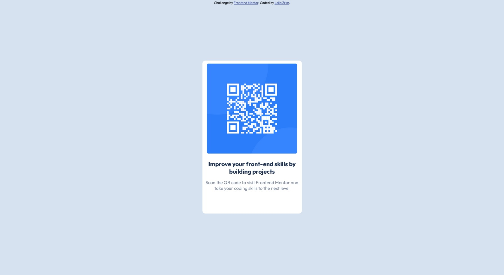

# Frontend Mentor - QR code component solution

This is a solution to the [QR code component challenge on Frontend Mentor](https://www.frontendmentor.io/challenges/qr-code-component-iux_sIO_H). Frontend Mentor challenges help you improve your coding skills by building realistic projects. 

## Table of contents

- [Overview](#overview)
  - [Screenshot](#screenshot)
  - [Links](#links)
- [My process](#my-process)
  - [Built with](#built-with)
  - [What I learned](#what-i-learned)
  - [Useful resources](#useful-resources)
- [Author](#author)


## Overview

### Screenshot



### Links

- Solution URL: [Solution](https://github.com/leila0202/qr-code-component-main)
- Live Site URL: [Live Site](https://leila0202.github.io/qr-code-component-main/)

## My process

### Built with

- HTML5 markup
- CSS


### What I learned

I learned how to center a div on the page:
```css
#divid {
  position: absolute;
  left: 50%;
  top: 50%;
  transform: translate(-50%, -50%);
  text-align: center; 
}
```


### Useful resources

- [How to center divs](https://blog.hubspot.com/website/center-div-css) - This helped me for centering the div.


## Author

- Frontend Mentor - [@leila0202](https://www.frontendmentor.io/profile/leila0202)


